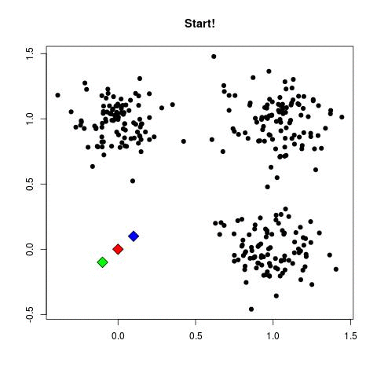
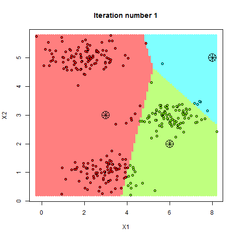
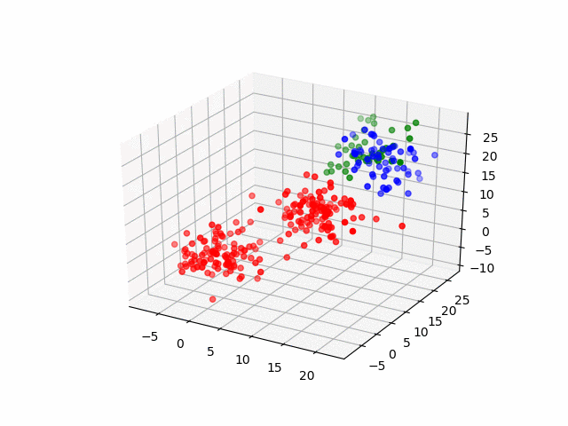

# Machine Learning Task Categories

\
\
\
\

# Machine Learning Definitions

1. Machine learning (ML) is a field of artificial intelligence (AI) that focuses on enabling computers to learn from data without being explicitly programmed.
2. Automating Learning Process

\
\
\
\

# The 4 Main Algorithms we will learn

1. ### Supervised Learning
   1. Regression
      1. `Linear Regression`
      2. `Polynomial Regression`
   2. Classification
      1. `Decision Trees`
      2. `K - Nearest Neighbours`
2. ### Unsupervised Learning
   1. Clustering
      1. `K - Means Clustering`

\
\
\
\
\
\

# 1. Regression (Supervised)
\
\
\
### **Definition**:

Prediction of a **numerical (continuous)** variable, where the output is a real value such as price, temperature, or age.

\
\
\

### **Common Algorithms**:

1. **Linear Regression** – Models the relationship between input features and a continuous target using a straight line.
2. **Decision Tree Regression** – Splits data into branches based on feature values and predicts numeric outcomes.

\
\
\

| Algorithm                            | Definition                                                                                                   |
| ------------------------------------ | ------------------------------------------------------------------------------------------------------------ |
| **Ridge Regression**                 | A linear regression with L2 regularization to reduce overfitting.                                            |
| **Lasso Regression**                 | Similar to Ridge but uses L1 regularization, which can shrink some coefficients to zero (feature selection). |
| **Polynomial Regression**            | Extends linear regression by modeling nonlinear relationships.                                               |
| **Support Vector Regression (SVR)**  | A version of SVM for regression tasks.                                                                       |
| **Random Forest Regression**         | Ensemble method using multiple decision trees.                                                               |
| **Gradient Boosting Regression**     | Sequentially builds models that correct the errors of previous ones.                                         |
| **Neural Networks (for regression)** | Deep learning models that can capture complex, nonlinear relationships.                                      |

\
\
\
\
\
\

# 2. Classification (Supervised)

\
\

### **Definition**:

Prediction of a **categorical** variable, i.e., assigning input data into predefined classes or categories (e.g., spam vs. not spam).

\
\

### **Common Algorithms**:

1. **Logistic Regression** – Despite the name, used for binary classification.
2. **K-Nearest Neighbors (KNN)** – Classifies data based on proximity to labeled examples.
3. **Decision Trees** – Splits data based on feature values to classify instances.

\
\

| Algorithm                                    | Definition                                                                              |
| -------------------------------------------- | --------------------------------------------------------------------------------------- |
| **Support Vector Machines (SVM)**            | Finds the optimal boundary (hyperplane) that separates classes.                         |
| **Random Forest**                            | Ensemble of decision trees to improve accuracy and reduce overfitting.                  |
| **Naive Bayes**                              | Based on Bayes’ theorem; assumes feature independence.                                  |
| **Gradient Boosting (XGBoost, LightGBM)**    | Powerful ensemble methods that improve predictive performance.                          |
| **Neural Networks**                          | Especially useful for complex classification tasks (e.g., image or speech recognition). |
| **Multinomial/Binary Classification Models** | For tasks involving more than two classes or just two.                                  |

\
\
\
\
\

# 3. Clustering (Unsupervised)

1. Partitions
2. Hyper-Dimensions
3. Centroids

\
\

### **Definition**:

**Unsupervised** learning task involving grouping data points into clusters based on similarity or distance, without predefined labels.

\
\

### **Common Algorithms**:

1. **K-Means Clustering** - Partitions data into *k* clusters by minimizing intra-cluster variance.

\
\

| Algorithm                                                                | Definition                                                                           |
| ------------------------------------------------------------------------ | ------------------------------------------------------------------------------------ |
| **Hierarchical Clustering**                                              | Builds a tree of clusters based on distance/similarity.                              |
| **DBSCAN (Density-Based Spatial Clustering of Applications with Noise)** | Groups data points that are closely packed together and identifies outliers.         |
| **Mean Shift**                                                           | Shifts data points towards the mode of the distribution to find clusters.            |
| **Gaussian Mixture Models (GMM)**                                        | Probabilistic model assuming data is generated from multiple Gaussian distributions. |
| **Agglomerative Clustering**                                             | A type of hierarchical clustering that builds clusters from the bottom-up.           |
| **Spectral Clustering**                                                  | Uses graph theory and eigenvalues for dimensionality reduction before clustering.    |
| **Birch (Balanced Iterative Reducing and Clustering using Hierarchies)** | Efficient for large datasets.                                                        |

