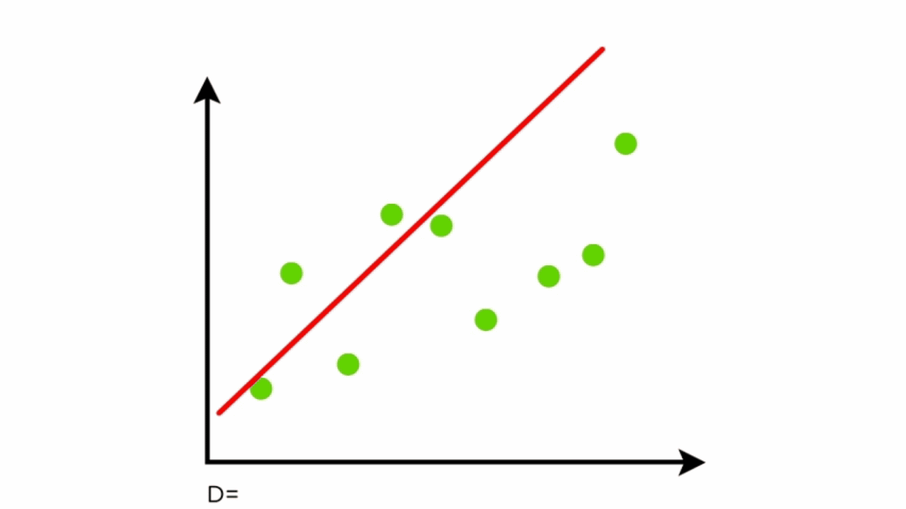

# Linear Regression

### Terminology

1. Iteration / Epoch
2. **Regression**: Predicting Neumeric Value
3. **Classification**: Predicting a Categorical Value
4. Equation / Function
5. Linear Equations
6. Quadratic Equation
7. Cubic Equations
8. Polynimial Equations
9.  Outliers
10. Optmization
11. Model Optimization or Model Training
12. Gradient Descent
13. Stochastic Gradient Descent
14. Overfitting & Underfitting
15. Feature scaling / normalization
16. Chain Rule (Calculus)

\
\
\
\
\

# Dataset Outline

| Features - ($x_1$) | Target - ($y$) |
| :----------------: | :------------: |
|         2          |       7        |
|         4          |       15       |
|         6          |       23       |
|         5          |       19       |

1. Feature Variables
2. Target Variable

\
\
\
\
\

# Model Outline

### Parameters (Coeficients, Constant / Bias)

\
\
\

1. Variables
   1. Features
   2. Target
2. Parameters
   1. Coefficients
   2. Bias / Constant

\
\
\

- 1 Feature Variable
  - $y= {\theta}_1 x + {\theta}_0$
- 2 Feature Variables
  - $y= {\theta}_1 ~ x_1 + {\theta}_2 ~ x_2 + {\theta}_0$
- `n` Feature Variables
  - $y= {\theta}_1 ~ x_1 + {\theta}_2 ~ x_2 + \dots + {\theta}_n ~ x_n + {\theta}_0$

\
\
\
\
\

# Model Evaluation (Error Calculation)

### Different Metrics :

1. Sum of Absolute Residuals 
2. Mean of Absolute Residuals
3. Mean Squared Error (MSE)
4. Root Mean Squared Error (RMSE)

### Example 1 :

##### Step 1: Initially

| Features ($x_1$) | Output ($y$) |
| :--------------: | :----------: |
|        2         |      7       |
|        4         |      15      |
|        6         |      23      |
|        5         |      19      |

- Task : Find the Model (Equation)

##### Step 3: Finally

| Features ($x_1$) | Output ($y$) | Predictited ($\hat{y}$) | Residual | Absolute-Residual |
| :--------------: | :----------: | :---------------------: | :------: | :---------------: |
|        2         |      7       |            9            |    -1    |         1         |
|        4         |      15      |           13            |    2     |         2         |
|        6         |      23      |           17            |    5     |         5         |
|        5         |      19      |           15            |    4     |         4         |

- Actual equation 
  - $y = 4~x-1$

- Guessed Equation
  - $y = 2~x+5$

### Example 2 :

\
\
\
\
\

# Training and Testing Data

### Main Dataset

### Training Dataset

### Testing Dataset

\
\
\
\
\

