# Artificial Intelligence Outline

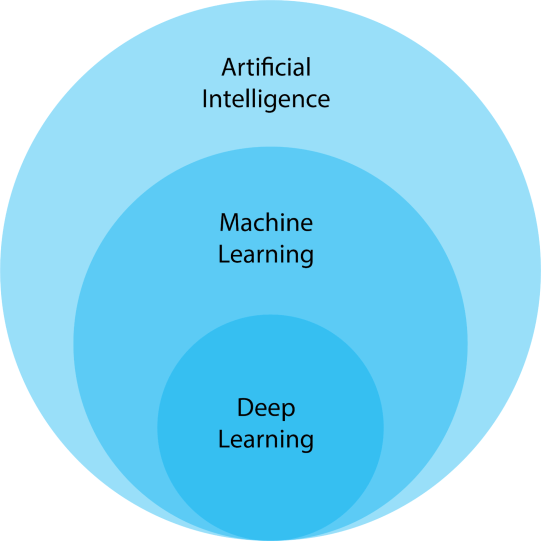

\
\
\
\
\
\
.
# 1. Rule Based Models

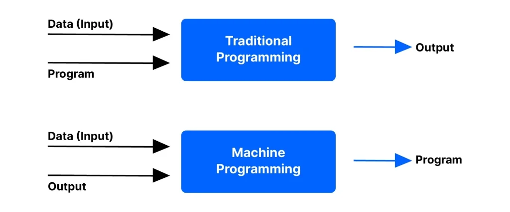

Rule-based models use a set of **if-then rules** created by humans to make decisions or solve problems.

* They are simple and easy to understand.
* These systems follow **predefined logic** without learning from data.
* Used in expert systems like medical diagnosis tools or chatbots with fixed responses.
* Example: If a customer spends over \$100, then give a 10% discount.

\
\
\
\
\
\
.

# 2. Machine Learning Models

Machine Learning (ML) models **learn from data** instead of being explicitly programmed.

* They find patterns in data to make predictions or decisions.
* Require labeled or unlabeled data depending on the type (supervised, unsupervised, or reinforcement).
* Improve over time with more data and feedback.
* Example: Email spam filters that learn to detect spam based on past emails.

### ML Outline
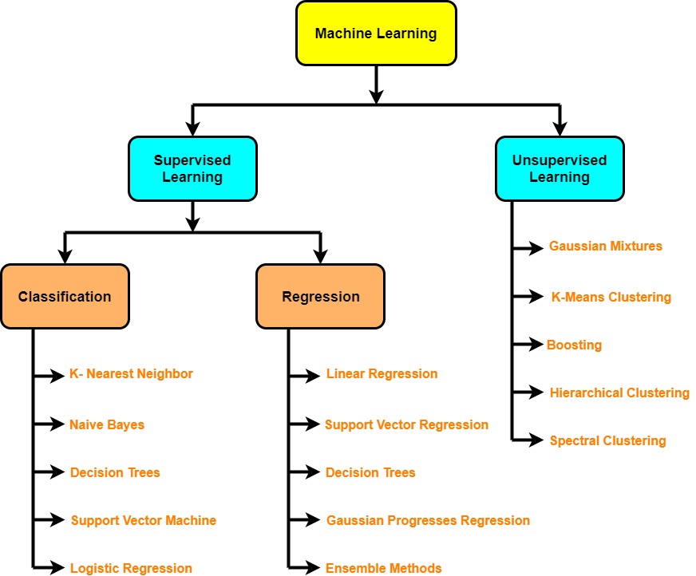

\
\
\
\
\
\
.

# 3. Deep Learning Models (Neural Networks)

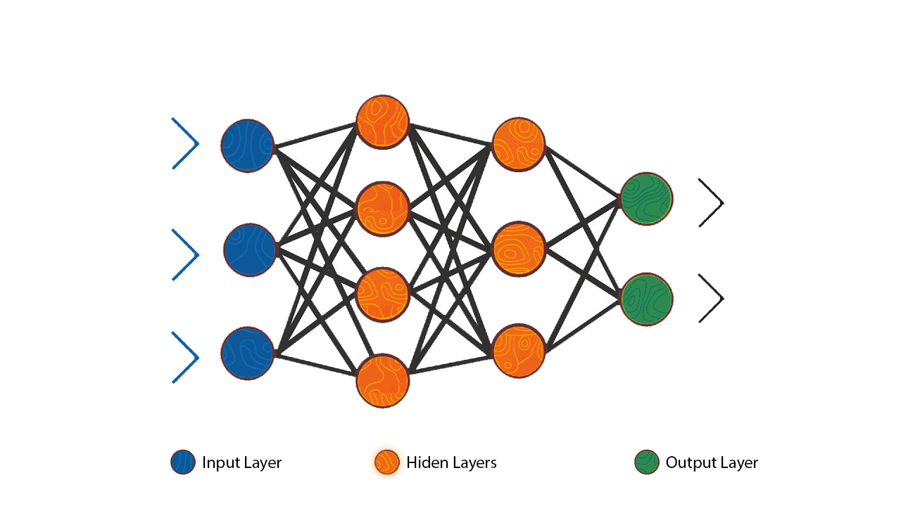

Deep Learning is a type of Machine Learning that uses **neural networks** with many layers to understand complex patterns.

* It works well with large datasets and high-dimensional data like images, audio, and text.
* Inspired by how the human brain processes information.
* Requires more computing power and time to train.

- **Visualization**: https://alexlenail.me/NN-SVG/

\
\
\
\
\
\
.

## 3.1 Natural Language Processing

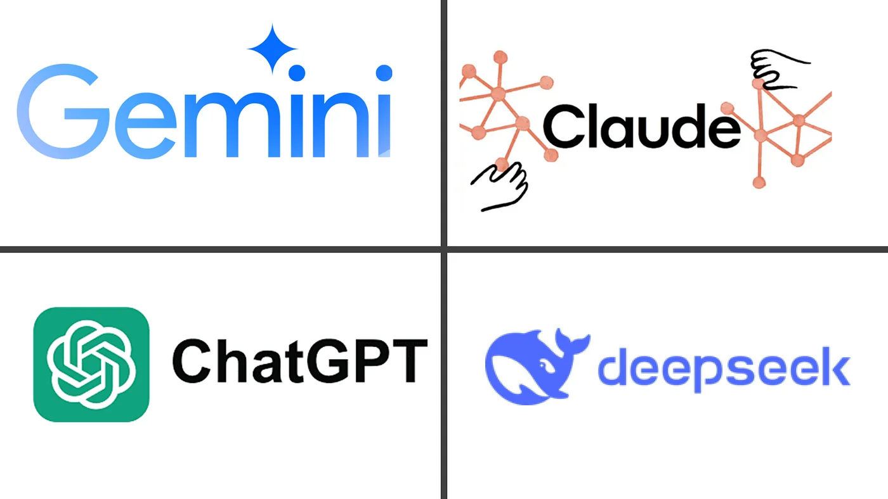

Natural Language Processing (NLP) allows machines to understand and respond to **human language**.

* Used in chatbots, voice assistants (like Siri), and language translators.
* Tasks include sentiment analysis, text generation, and summarization.
* Example: Auto-correct or autocomplete on smartphones.

\
\
\
\
\
\
.

## 3.2 Computer Vision

Computer Vision helps machines **see and understand images or videos**.

* Used in face recognition, self-driving cars, and medical imaging.
* Can detect objects, read handwriting, or classify photos.
* Example: Unlocking a phone with facial recognition.

### Examples :
#### Object Localization
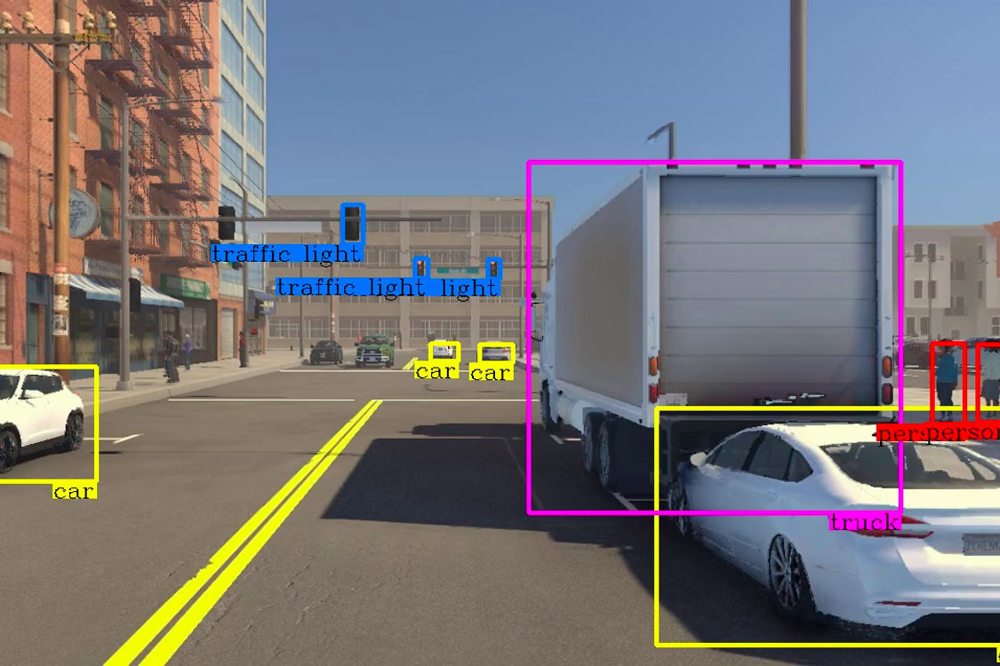
\
\
\
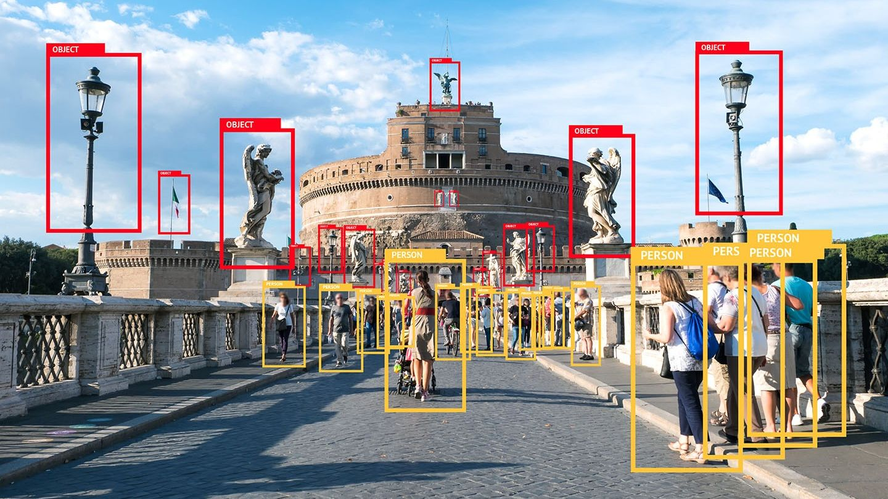
#### Self Driving Cars
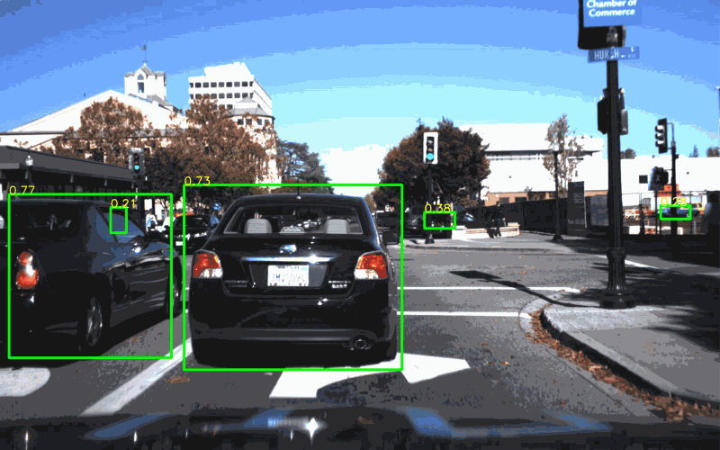
#### Others
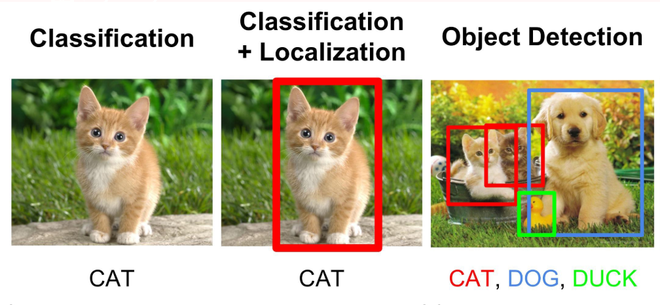
\
\
\

\
\
\

\
\
\
### Human Pose Estimation

\
\
\
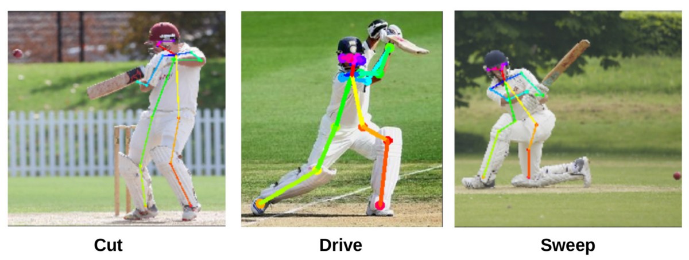
\
\
\

\
\
\
\
\
\
.

## 3.3 Reinforcement Learning

1. Score Reward & Penality

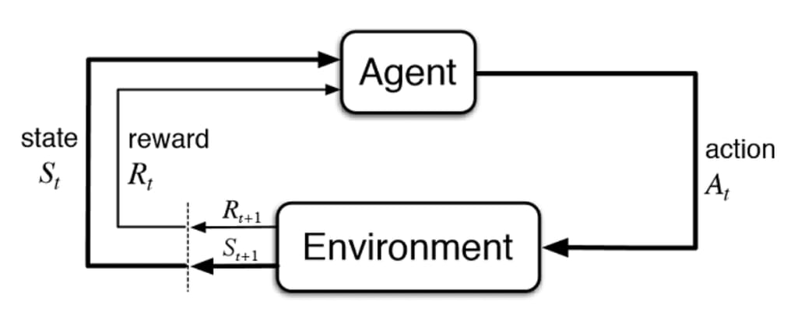

Reinforcement Learning is about training an agent to make decisions by **reward and punishment**.

* The agent learns by trying actions and learning from the results.
* Used in robotics, game playing, and autonomous systems.
* Example: A robot learning to walk or a program playing chess.

### Example :

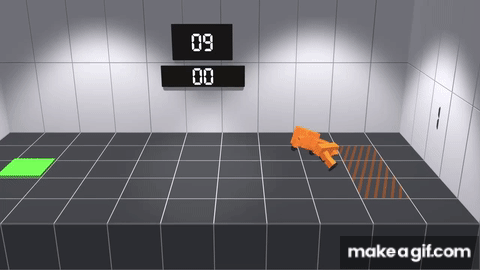
\
\
\
\
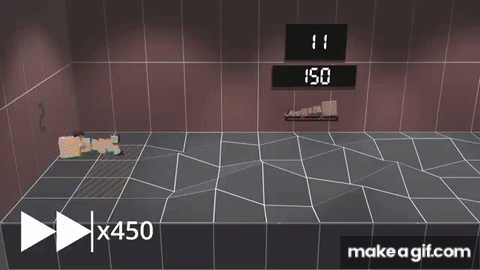
\
\
\
\
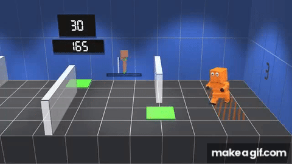
\
\
\
\

\
\
\
\
\
\
.

## 3.4 Recommender Systems

1. Similarity Score
2. Vector Representation

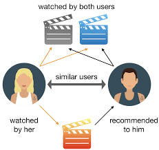

Recommender Systems suggest items based on user preferences or behavior.

* Common in online shopping, music, and video platforms.
* Use past data to predict what a user might like next.
* Example: Netflix recommending shows or Amazon suggesting products.
