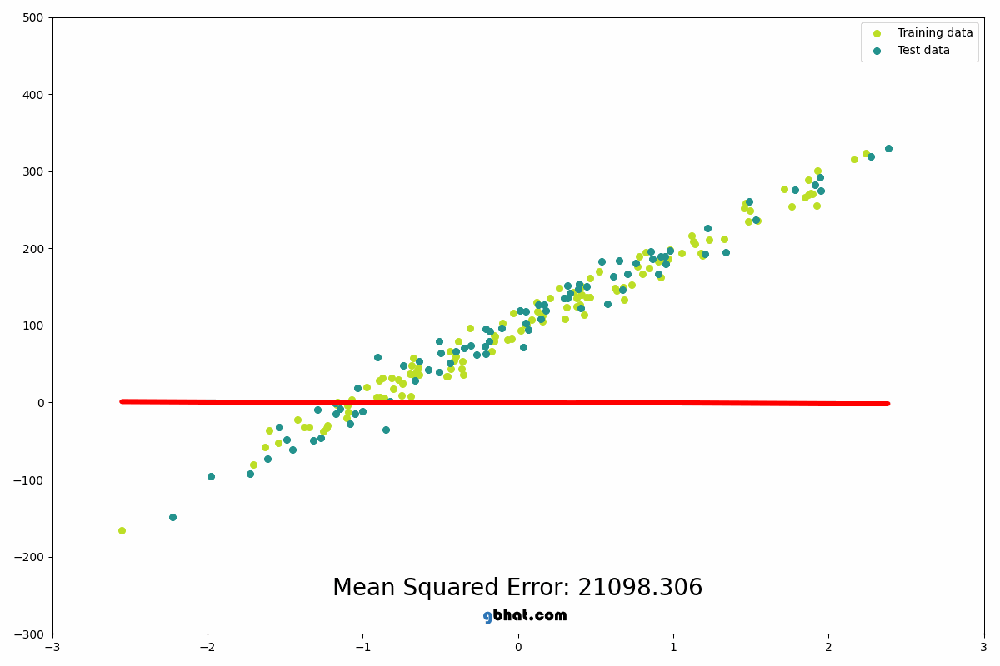

# Linear Regression


\
\
\
\
\


# Dataset Outline

| Features - ($x_1$) | Target - ($y$) |
| :----------------: | :------------: |
|         2          |       7        |
|         4          |       15       |
|         6          |       23       |
|         5          |       19       |

1. Feature Variables
2. Target Variable

\
\
\
\
\


# Model Outline

### Parameters (Coeficients, Constant / Bias)

\
\
\

1. Variables
   1. Features
   2. Target
2. Parameters
   1. Coefficients
   2. Bias / Constant

\
\
\

- 1 Feature Variable
  - $y= {\theta}_1 x + {\theta}_0$
- 2 Feature Variables
  - $y= {\theta}_1 ~ x_1 + {\theta}_2 ~ x_2 + {\theta}_0$
- `n` Feature Variables
  - $y= {\theta}_1 ~ x_1 + {\theta}_2 ~ x_2 + \dots + {\theta}_n ~ x_n + {\theta}_0$


\
\
\
\
\


# Model Evaluation (Error Calculation)


### Different Metrics :

1. Sum of Absolute Residuals 
2. Mean of Absolute Residuals
3. Mean Squared Error (MSE)
4. Root Mean Squared Error (RMSE)

### Example 1 :

##### Step 1: Initially

| Features ($x_1$) | Output ($y$) |
| :--------------: | :----------: |
|        2         |      7       |
|        4         |      15      |
|        6         |      23      |
|        5         |      19      |

- Task : Find the Model (Equation)


##### Step 3: Finally

| Features ($x_1$) | Output ($y$) | Predictited ($\hat{y}$) | Residual | Absolute-Residual |
| :--------------: | :----------: | :---------------------: | :------: | :---------------: |
|        2         |      7       |            9            |    -1    |         1         |
|        4         |      15      |           13            |    2     |         2         |
|        6         |      23      |           17            |    5     |         5         |
|        5         |      19      |           15            |    4     |         4         |


- Actual equation 
  - $y = 4~x-1$

- Guessed Equation
  - $y = 2~x+5$

### Example 2 :


\
\
\
\
\
\
\
\
\
\
\

# Model Evaluation - Regression Task

## ✅ 1. Mean Absolute Error (MAE)

$$
\text{MAE} = \frac{1}{n} \sum |y_{\text{true}} - y_{\text{pred}}|
$$

* **Interpretation**: Average absolute difference between prediction and actual value
* **Robust to outliers**: ✅ (compared to MSE)

```python
from sklearn.metrics import mean_absolute_error
mae = mean_absolute_error(y_test, y_pred)
```

---

## ✅ **2. Mean Squared Error (MSE)**

$$
\text{MSE} = \frac{1}{n} \sum (y_{\text{true}} - y_{\text{pred}})^2
$$

* **Interpretation**: Penalizes larger errors more heavily
* **Sensitive to outliers**: ✅

```python
from sklearn.metrics import mean_squared_error
mse = mean_squared_error(y_test, y_pred)
```

---

## ✅ **3. Root Mean Squared Error (RMSE)**

$$
\text{RMSE} = \sqrt{\text{MSE}}
$$

* **Same units** as target variable
* **Popular and interpretable**

```python
rmse = mean_squared_error(y_test, y_pred, squared=False)
# or:
import numpy as np
rmse = np.sqrt(mse)
```

---

## ✅ **4. R-squared (R² Score)**

$$
R^2 = 1 - \frac{\sum (y_{\text{true}} - y_{\text{pred}})^2}{\sum (y_{\text{true}} - \bar{y})^2}
$$

* **Explained variance**: How much of the variance is captured by the model
* R² = 1: Perfect model, R² = 0: Mean-only model
* Can be **negative** if model performs worse than baseline

```python
from sklearn.metrics import r2_score
r2 = r2_score(y_test, y_pred)
```

---

## ✅ **5. Mean Absolute Percentage Error (MAPE)**

$$
\text{MAPE} = \frac{100}{n} \sum \left| \frac{y_{\text{true}} - y_{\text{pred}}}{y_{\text{true}}} \right|
$$

* **Percentage-based error**
* Sensitive when `y_true` values are close to 0

```python
from sklearn.metrics import mean_absolute_percentage_error
mape = mean_absolute_percentage_error(y_test, y_pred)
```

---

## ✅ Summary Table

| Metric | Good For               | Sensitive to Outliers? | Output Unit          |
| ------ | ---------------------- | ---------------------- | -------------------- |
| MAE    | Interpretability       | ❌                      | Same as target       |
| MSE    | Penalizing big errors  | ✅                      | Squared target units |
| RMSE   | Popular, interpretable | ✅                      | Same as target       |
| R²     | Explained variance     | ❌                      | Unitless             |
| MAPE   | Percent error          | ✅ (zero-division risk) | %                    |

---

### ✅ Example Code Block

```python
from sklearn.metrics import mean_absolute_error, mean_squared_error, r2_score, mean_absolute_percentage_error
import numpy as np

mae = mean_absolute_error(y_test, y_pred)
mse = mean_squared_error(y_test, y_pred)
rmse = np.sqrt(mse)
r2 = r2_score(y_test, y_pred)
mape = mean_absolute_percentage_error(y_test, y_pred)

print(f"MAE: {mae:.2f}")
print(f"MSE: {mse:.2f}")
print(f"RMSE: {rmse:.2f}")
print(f"R² Score: {r2:.2f}")
print(f"MAPE: {mape:.2%}")
```